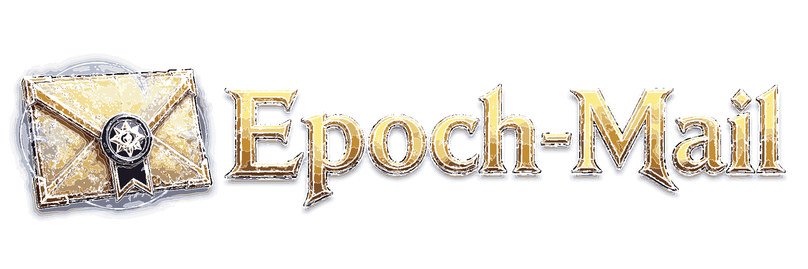
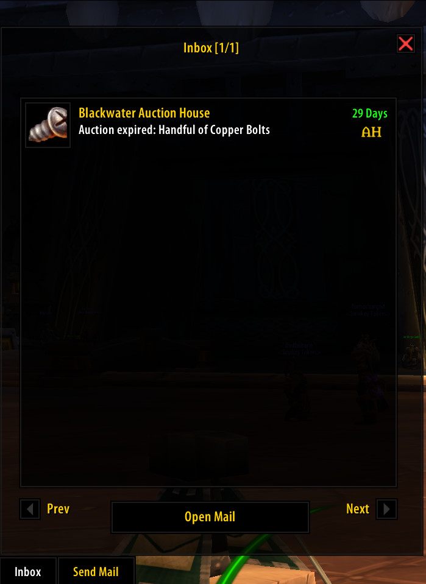
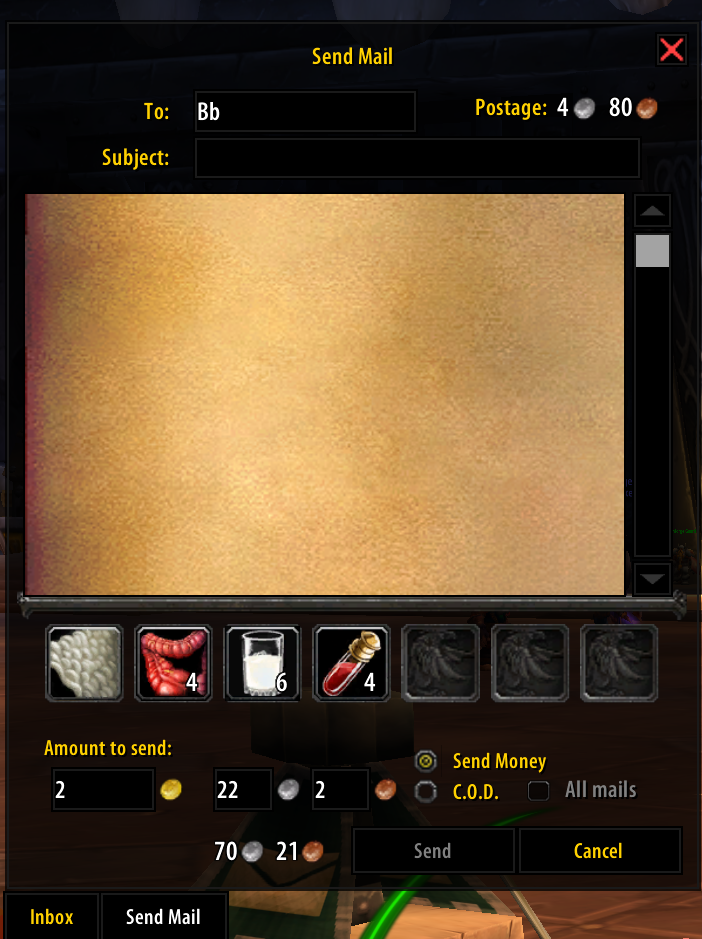

  

**A Classic WOTLK WoW 3.3.5 (and Project Epoch WoW) mail addon for easy open of mails or sending multiple items.** Not for Retail.

<h4><picture>
  <source media="(prefers-color-scheme: dark)" srcset="Images/Screenshot_1.png">
  
</picture>
<picture>
  <source media="(prefers-color-scheme: dark)" srcset="Images/Screenshot_2.png">
  
</picture> 

Ported for Epoch by **Fragglechen**.  
Special thanks to **shirsig/sica**, the original TurtleMail addon authors.

## Features

* Rapid mailbox handling for opening many mails in sequence.
* Open all mail support with fast collection of attachments and money.
* Multi-item sending with custom attachment slots.
* Recipient autocomplete with remembered character names.
* Inbox markers for Auction House mail and returned mail.
* Quick right-click inbox actions for money, items, and cleanup.
* Gold summary for collected inbox money.
* C.O.D. support for one or all selected mails.
* Sent and received mail logging.
* pfUI skin support for the custom mail interface.

## Documentation

⬇️ [Installation](#installation)

## Installation

### Easy mode (recommended)

Use [EpochAddonUpdater](https://github.com/Fragglechen/EpochAddonUpdater).  
Or any tool that supports Git-based addon updates.

### Manual

1. [Download EpochMail](https://github.com/Fragglechen/EpochMail/releases/latest).
2. Extract the zip file.
3. Ensure the resulting folder is named `EpochMail`.
4. Move that folder to `[Path\To\WoW]\Interface\AddOns`.
5. Ensure the structure is `Interface\AddOns\EpochMail\EpochMail.toc`.  
   *These are all **wrong**:*  
   × `EpochMail\EpochMail\EpochMail.toc`  
   × `EpochMail-main\EpochMail.toc`  
   × `EpochMail\EpochMail-main\EpochMail.toc`
   

## Usage

* **Right-click** inbox entries to loot money, loot items, and delete the message in that order, when applicable.
* **Right-click** or **left-drag** inventory items onto attachments while composing mail.
* **Right-click** to add inventory items to the trade frame.
* C.O.D. is always ignored when opening mail, both automatically and via **right-click**.
* Logging is disabled by default and can be enabled with `/tm log`.

## Compatibility

### Functionality

<table>

<tr>
<td>

### Auction and Mail
Right-click/Alt+click attach

</td>
<td>

* Blizzard UI
* [aux](https://github.com/Fragglechen/aux-addon-epoch)
* [Mail](https://github.com/Fragglechen/EpochMail)

</td>
</tr>

<tr>
<td>

### Cooldown counts

</td>
<td>

* [OmniCC](https://felbite.com/addon/4773-omnicc/)
* [pfUI](https://github.com/Fragglechen/pfUI/)

</td>
</tr>

<tr>
<td>

### Interface replacement

</td>
<td>

* [pfUI](https://github.com/Fragglechen/pfUI/) skin  
Manage in **pfUI Config** (`/pfui`) > **Components** > **Skins**

</td>
</tr>

<tr>
<td>

### [Rule functions]

</td>
<td>

* `Outfit()` - [ItemRack](https://github.com/Defcons/epoch-addons/releases/tag/ItemRack-v1.0) and [Outfitter](https://www.curseforge.com/wow/addons/outfitter-retrofit)
* `Wishlist()` - [AtlasLoot](https://github.com/reneas/AtlaslootProjectEpoch)

</td>
</tr>

<tr>
<td>

### T- Mog

</td>
<td>

* **Guild Bank** right-click to deposit.
* [Tmog](https://github.com/Fragglechen/Tmog-epoch).

</td>
</tr>

</table>

### Languages

If EpochMail has not been localized for your client, some interface text may remain untranslated. Please consider contributing a translation if you'd like to improve support for your locale.

* English (enUS)
* German (deDE)
* Spanish (esES)
* French (frFR)
* Russian (ruRU)

## Donations
Developing EpochMail is fun, but also a lot of work! Your support is hugely appreciated.  

## Credits

EpochMail is based on TurtleMail by **shirsig/sica**, with Project Epoch porting and compatibility work by **Fragglechen**.
